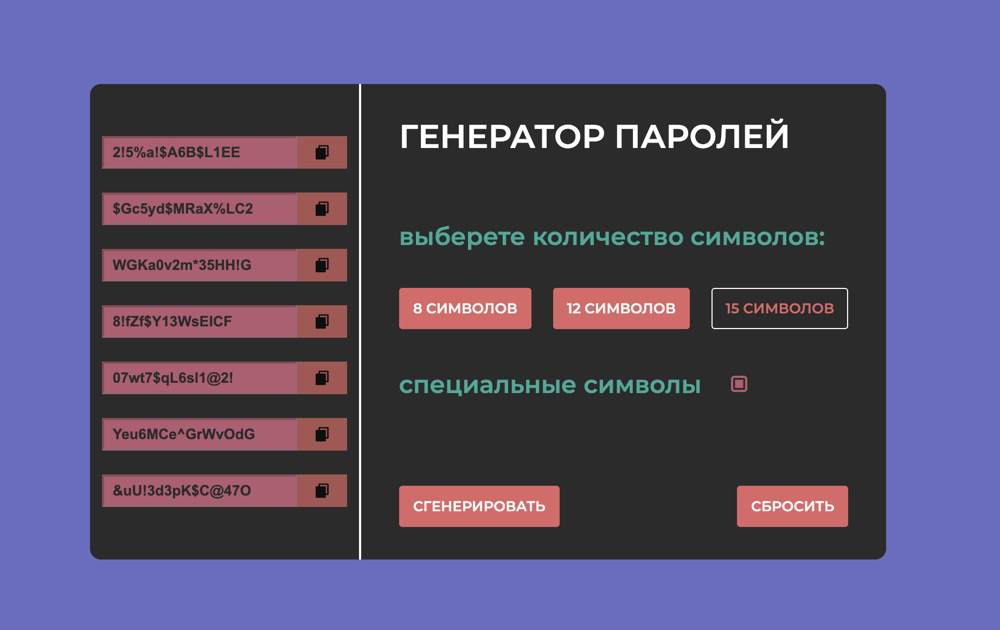

# 🔐 Password Generator – Генератор Паролей 💻

---

---

Простой и удобный веб‑генератор паролей, который помогает создавать надёжные, безопасные и случайные пароли всего за пару секунд!

---

## 🚀 Особенности

- 🧮 Генерация сложных паролей любой длины
- 🔣 Поддержка букв (заглавных и строчных), цифр и специальных символов
- 🎨 Возможность визуальной настройки (цвета, стиль)
- 📋 Быстрое копирование в буфер обмена
- ⚡ Мгновенный результат без перезагрузки страницы

---

## 💻 Использование

1. Установите длину пароля.
2. Выберите, какие символы включить:
   - 🔠 Заглавные буквы
   - 🔡 Строчные буквы
   - 🔢 Цифры
   - ❗ Специальные символы
3. Нажмите кнопку «Сгенерировать».
4. Копируйте пароль и используйте его в нужном месте.

---

## 🛠 Технологии

- HTML5 / CSS3 💻
- JavaScript (ES6+) ⚡
- Адаптивная верстка для ПК, планшетов и мобильных устройств 📱
- Работа без серверной части — полностью клиентское приложение 🌐

---

## 🔮 Планы на будущее

- Добавить генерацию паролей с запоминанием шаблонов 🔄
- Интеграция с менеджерами паролей 🗄️
- Визуальные улучшения и анимации 🎨

---

## ⚠️ Ограничения

- Приложение работает полностью в браузере — требуется интернет только для загрузки страницы.
- Рекомендуется использовать с осторожностью и не хранить важные пароли в общедоступных местах.

---

## ✉️ Обратная связь

Если вы нашли баг или хотите предложить новую фичу, пишите: den_maverick177@mail.ru

---

## 🔖 Лицензия

Все права защищены © 2025 **Denny Maverick**.
Никто не может копировать, изменять или распространять этот код без разрешения автора.

---

## 🙏 Благодарности

- Всем, кто вдохновлял и помогал тестировать приложение
- Ресурсам по генерации безопасных паролей и JavaScript-урокам